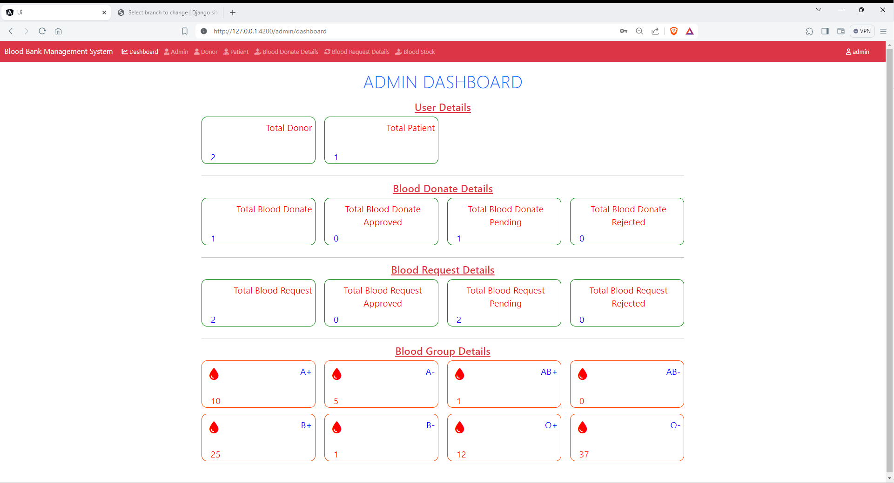
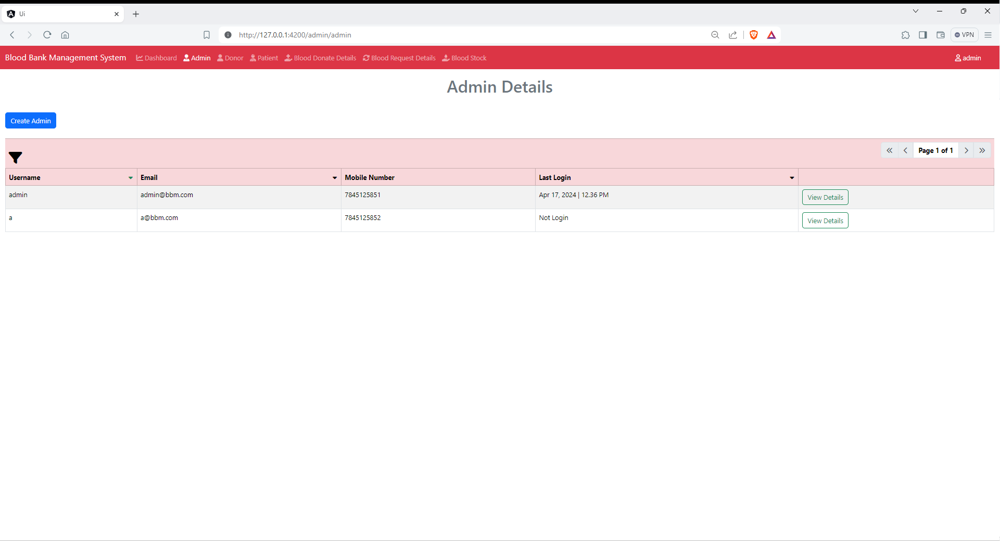
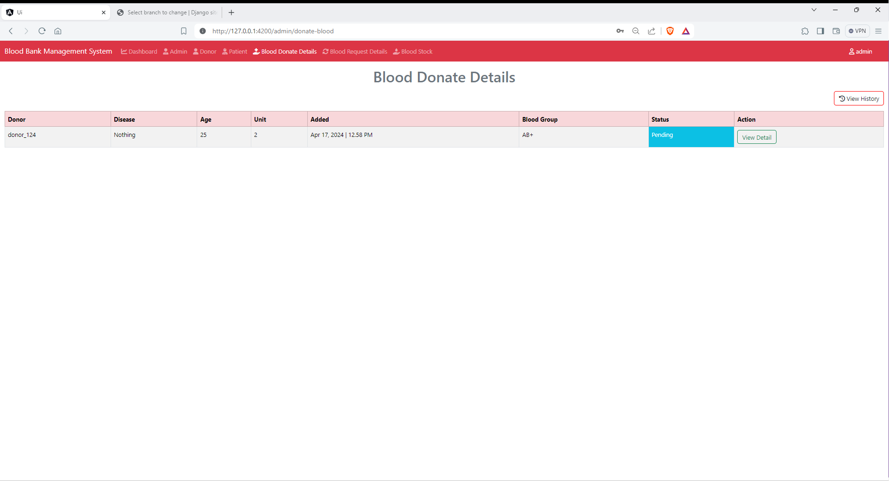
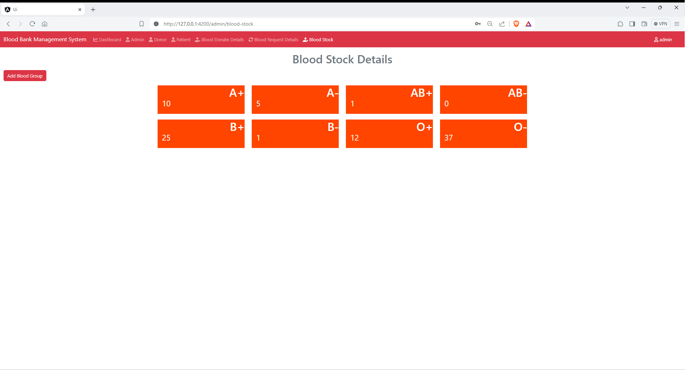
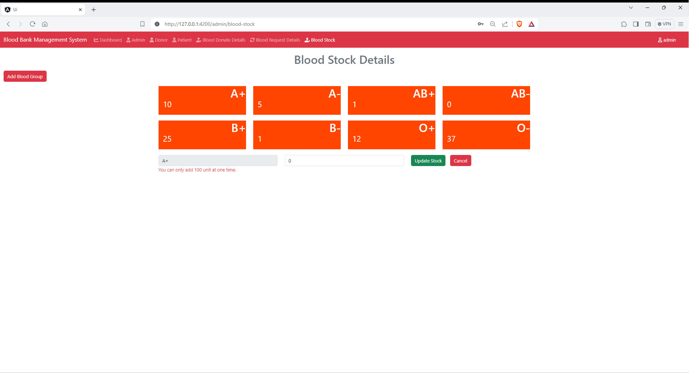
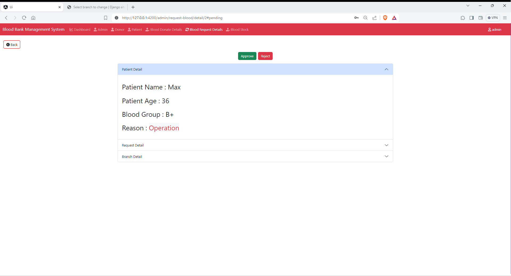
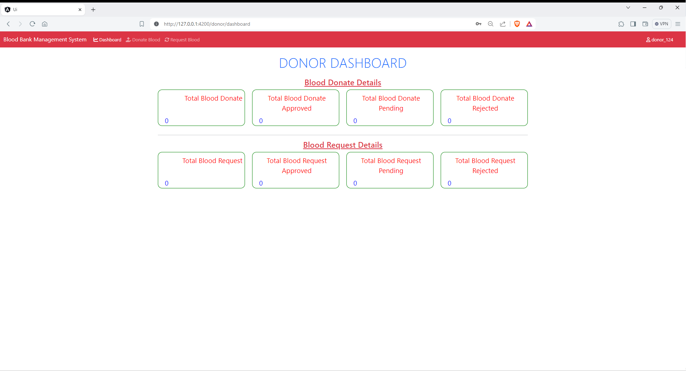
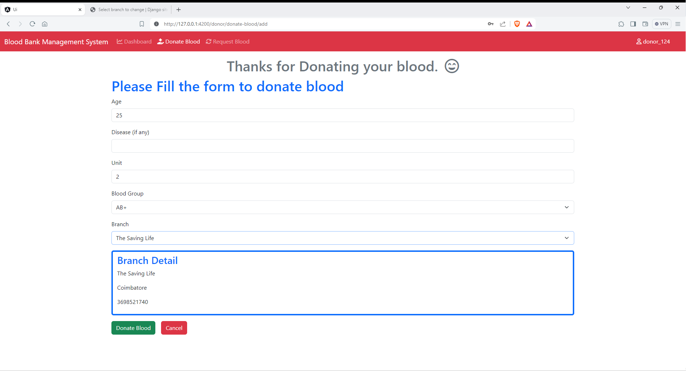
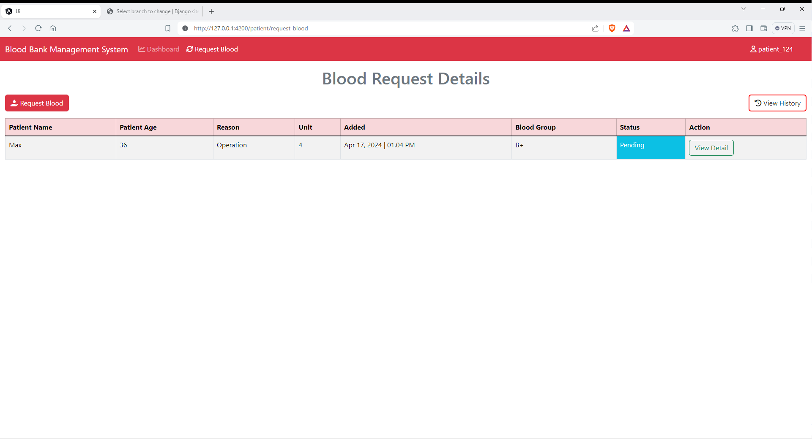

# Blood Bank Management

This website is for managing blood in blood bank.

---

## Skills

### Backend

- Django
- Django Rest Framework

### Frontend

- Angular
- Bootstrap

### Database

- MySql

### Steps to run the project

> [!TIP]
>
> 1. Download the project.
> 2. Create a virtual environment and **activate it**.
> 3. Run command **pip install -r requirements.txt** to install python dependencies.
> 4. Run command **py db.py** to create a database and an user (Make sure MySQL is installed in your System).
> 5. Run command **py manage.py migrate** to migrate tables in a database.
> 6. Run command **py manage.py shell < y_code\*.py** to create mock data in a table.
> 7. Run command **py manage.py runserver** to run django server.
> 8. Go to ui folder.
> 9. Run command **npm install --save --legacy-peer-deps** to install angular dependencies.
> 10. Run command **npm start** to run the angular project.

---

## Screenshot of this Application

- **Main Page**
  
- **Login Page**
  
- **Registration Page**
  

<!-- Admin pages -->

- **Admin dashboard**
  
- **Admin detail**
  
- **Donor detail**
  
- **Patient detail**
  
- **Blood donate detail**
  
- **Blood request detail**
  
- **Blood stock view**
  
- **Blood stock edit view**
  
- **Add blood group view**
  
- **Detail view**
  

<!-- Donor pages -->

- **Donor dashboard**
  
- **Blood donate details view**
  
- **Donor blood donate detail view**
  
- **Donor form**
  

<!-- Patient pages -->

- **Patient dashboard**
  
- **Blood request details view**
  
- **Patient blood request detail view**
  
- **Patient form**
  

<!-- Profile view page -->

- **Profile view**
  
